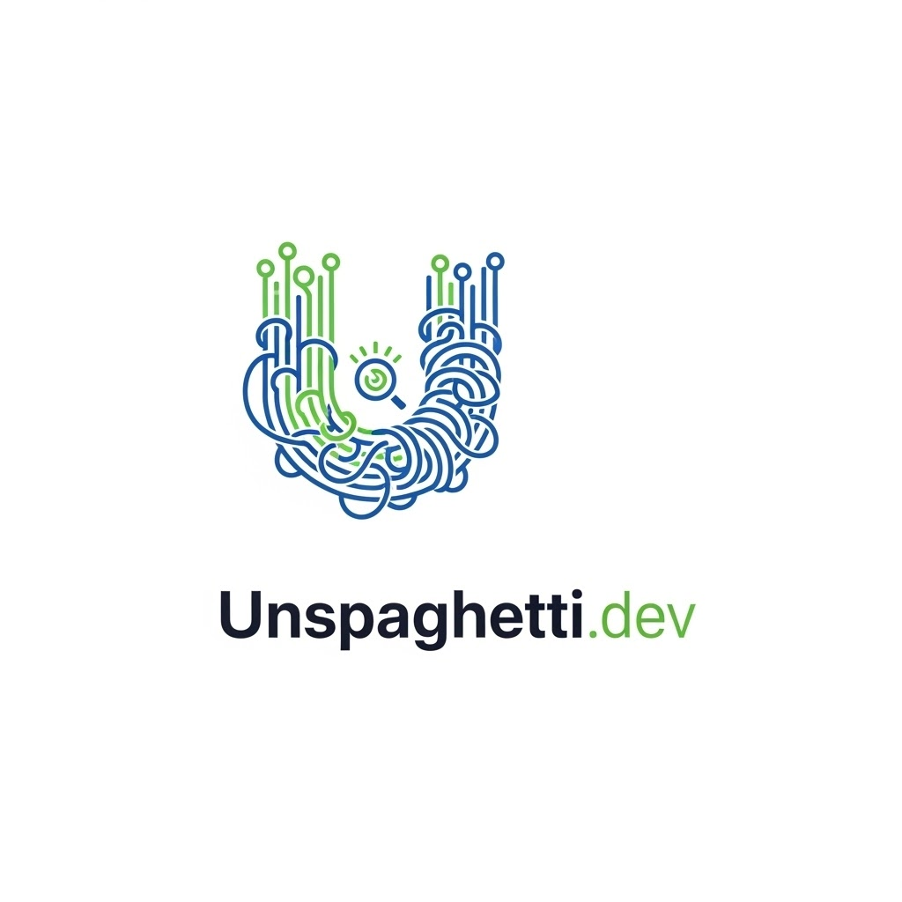

# 🍝 Unspaghetti Platform

> **The AI Intelligence Layer for your messy Code & Data.**
> _"Don't let your development lifecycle be a tangled mess. Unspaghetti it."_



## 📖 Overview
**Unspaghetti Platform** is a full-stack AI application designed to solve two massive engineering bottlenecks: **"Spaghetti Data"** (messy datasets) and **"Spaghetti Code"** (undocumented legacy codebases).

It combines **Automated Data Engineering** (ETL) with **Retrieval-Augmented Generation (RAG)** to provide a unified intelligence layer for developers and data scientists.

## 🚀 Features

### 📊 Module A: The Data Untangler
* **Automated Diagnosis:** Instantly scans CSV files for missing values, data type mismatches, and structural errors.
* **One-Click Cleaning:** Uses Pandas-based logic to impute missing values and normalize data formats.
* **Export Pipeline:** Generates and downloads clean, ML-ready datasets instantly.

### 💻 Module B: The Code Brain
* **Repository Ingestion:** Clones public GitHub repositories using `GitPython` and performs static analysis.
* **AST Parsing:** Uses Python's Abstract Syntax Tree (AST) to understand function and class structures without executing code.
* **AI Chat (RAG):** Allows users to ask natural language questions about the codebase (e.g., *"How does authentication work?"*) using LangChain and Vector Search.

## 🛠️ Tech Stack

### Frontend
* **Framework:** React.js (Vite)
* **Styling:** CSS Modules (Glassmorphism Design System)
* **HTTP Client:** Axios

### Backend
* **API:** FastAPI (Python 3.10+)
* **Data Processing:** Pandas, NumPy
* **AI & ML:** LangChain, Scikit-Learn (Vector Store), OpenAI API
* **System Tools:** GitPython, Python AST

## ⚙️ Installation & Setup

### Prerequisites
* Python 3.10+
* Node.js & npm
* Git

### 1. Clone the Repository
```bash
git clone [https://github.com/YOUR_USERNAME/unspaghetti-platform.git](https://github.com/YOUR_USERNAME/unspaghetti-platform.git)
cd unspaghetti-platform
2. Setup Backend (The Brain)
Bash

# Install Python dependencies
python -m pip install fastapi uvicorn pandas python-multipart gitpython langchain-community langchain-openai scikit-learn tiktoken

# Run the Server
python -m uvicorn main:app --reload
The backend runs on http://127.0.0.1:8000

3. Setup Frontend (The Interface)
Open a new terminal window:

Bash

cd frontend

# Install Node dependencies
npm install

# Run the React App
npm run dev
The frontend runs on http://localhost:5173

🧠 Configuration (Optional)
To enable the Real AI features (Chat with Code), you need an OpenAI API Key.

Open main.py.

Locate OPENAI_API_KEY = None.

Replace None with your key: OPENAI_API_KEY = "sk-...".

Note: Without a key, the system runs in "Mock Mode" to demonstrate architecture functionality.

📄 License
This project is open-source and available under the MIT License.